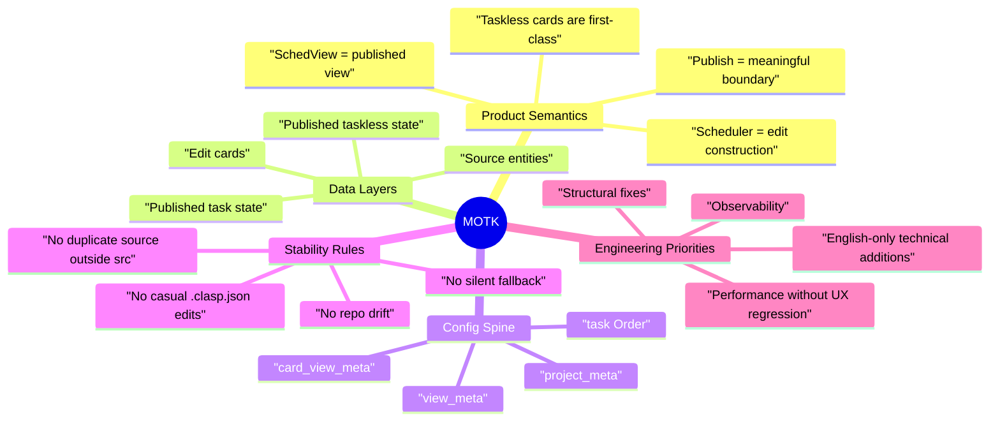

# Foundational Mental Model

## Core idea

MOTK is not one schedule. It is three layers that intentionally do not collapse into one another.

1. Source entities
- `Shots`
- `Assets`
- `Tasks`
- `ProjectMembers`
- `Users`

2. Edit construction layer
- `Cards` inside Scheduler
- slot-based, interactive, specialist-facing
- includes taskless cards and temporary working arrangements

3. Published view layer
- `Tasks` with published fields (`assignee`, `start`, `end`, `task order`)
- `sched.card_view_meta` for taskless published items
- date/order/lane view semantics

The system only remains understandable if these layers stay distinct.

## Why Publish exists

Publish is not a sync button for convenience.
Publish is the explicit act that says:
- this arrangement is now approved enough to project outward
- view consumers should see this state
- ordering becomes canonical

Do not redesign the system in a way that erases this meaning.

## Why taskless cards exist

Taskless cards are not accidental leftovers.
They represent planning information that must exist even when there is no task row.
This is why collapsing everything into `Task` has been considered and rejected.

## Why SchedView exists separately

SchedView is not merely a visual mode toggle.
Its reason to exist is:
- lighter mental model
- lower rendering/interaction burden
- broader user audience
- published-state consumption rather than live construction editing

## Why repo truth matters so much

The repo/worktree/clasp arrangement is unusual but deliberate.
It allows:
- local physical `src/` workspace
- remote Git root MOTK files
- fixed `clasp` deploy path

Breaking this invariant causes cascading confusion across Git, deploys, and trust in the session.

## Mind map

## Practical decision filter

Before making any change, test it against these questions:

1. Does it blur Edit and Published state?
2. Does it weaken Publish as a product boundary?
3. Does it introduce hidden fallback instead of explicit failure?
4. Does it risk repo truth drift?
5. Does it trade away usability just to simplify code?

If the answer to any of 1 to 4 is yes, stop and redesign.
